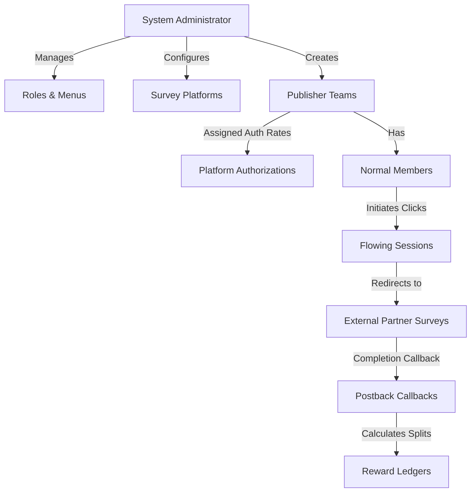

# SurveyStream Portal - 12. Team, Platform, and Member System Deep-Dive

This document provides a highly detailed specification of the **Team, Platform, and Member system** in the SurveyStream ecosystem. It covers everything from the database schemas, administrator-level Role-Based Access Control (RBAC), member authentication tokens, down to the exact mathematical commission split equations and redirect mechanics. This specification contains all parameters and logical structures necessary to recreate the entire subsystem.

---

## 1. High-Level Architectural Overview

The application functions as a multi-tenant survey routing middleware and reward ledger. It connects **Survey Platforms (API Providers)**, **Publisher Networks (Teams)**, and **End Users (Members)**.



*   **System Administrators**: Have root access to configure platforms, set global APIs, monitor overall analytics, manage team settings, and override system settings.
*   **Publisher Teams**: Business organizations (e.g., offerwalls or publisher networks) that drive traffic. They are assigned a `commission_ratio` globally and can have override rates (`auth_rate`) configured per survey platform.
*   **Normal Members**: End-users belonging to a specific team who answer surveys. They authenticate via their team's portal and earn reward coins based on the split system.

---

## 2. Database Schema Blueprint (Prisma/MySQL)

Below are the exact database table mappings from the core schema (`ya_` namespace).

### 2.1 Team Table (`ya_team`)
Represents the publisher networks.
*   `team_id` (Int, PK, AutoIncrement): Unique identifier for the team.
*   `team_name` (String): Display name of the publisher network.
*   `team_host` (String, Optional): Domain name constraint assigned to the team.
*   `team_logo` (Int, Optional): Resource ID referencing the logo image.
*   `commission_ratio` (Float, Default: `0.00`): The percentage commission retained by the platform from this team's earnings.
*   `auth_num` (Int, Default: `0`): Numeric parameter tracking active platform permissions.
*   `is_disable` (Int, Default: `0`): Soft disable status (`1` = disabled, `0` = active).
*   `sort` (Int, Default: `0`): Sorting ordering priority.

### 2.2 Member Table (`ya_member`)
Represents end-users who answer surveys.
*   `member_id` (Int, PK, AutoIncrement): Unique member identifier.
*   `nickname` (String): Display nickname.
*   `rate` (Float, Default: `0.00`): Custom commission rate deducted specifically for this member (individual user split adjustment).
*   `team_id` (Int, FK): References `ya_team.team_id`.
*   `avatar_id` (Int, Optional): Resource ID referencing the avatar image.
*   `is_disable` (Int, Default: `0`): Soft disable status (`1` = disabled).
*   `password` (String, Optional): Hashed member password.

### 2.3 Platform Table (`ya_platform`)
Configures the third-party survey provider integrations.
*   `platform_id` (Int, PK, AutoIncrement): Unique platform identifier.
*   `platform_name` (String): Display name of the provider (e.g., "Dynata", "Zamplia").
*   `platform_sign` (String, Unique): System identifier (e.g., "mirat", "Zamplia").
*   `platform_image` (LongText, Optional): Base64 or URL path to the logo.
*   `platform_color` (String, Optional): Hex code styling color.
*   `platform_url` (String, Optional): API base endpoint.
*   `platform_quota_url` (String, Optional): Quota validation API endpoint.
*   `platform_click_url` (String, Optional): Base click-out URL to send members.
*   `params` (String/JSON, Optional): Array of encrypted credential key-value structures.
*   `project_params` (String/JSON, Optional): Mappings for incoming project parameters.
*   `is_list` / `is_wall` / `is_persona` (Int, Default: `0`): Interface visibility config flags.
*   `is_quota` (Int, Default: `0`): Whether quota verification is enabled.
*   `is_accept_error` (Int, Default: `0`): Whether disqualified/terminated callbacks should be recorded.
*   `limit_endtime` (Int, Default: `0`): Minimum allowed duration (in minutes) to complete the survey. completions faster than this are marked as speeders (`is_mark = 1`).

### 2.4 Platform Authorization Table (`ya_platform_auth`)
Intersection table defining customized splits and access rules per team per platform.
*   `platform_auth_id` (Int, PK, AutoIncrement): Unique record identifier.
*   `platform_id` (Int, FK): References `ya_platform.platform_id`.
*   `team_id` (Int, FK): References `ya_team.team_id`.
*   `auth_rate` (Float, Default: `0.00`): Override split deduction rate for this specific team on this specific platform.

### 2.5 Flowing (Click Log) Table (`ya_flowing`)
Logs all outbound clicks to external partner survey links.
*   `flowing_id` (Int, PK, AutoIncrement): Unique log identifier.
*   `uuid` (String, Unique): Unique transaction tracking identifier passed to the external platform.
*   `member_id` (Int, FK): References `ya_member.member_id`.
*   `project_id` (Int, FK, Optional): References the target project.
*   `ip` (String, Optional): Client IPv4/IPv6 address.
*   `ua` (String, Optional): Client User-Agent string.
*   `rs_content` (String/JSON, Optional): Snapshot of demographic questionnaires completed before redirection.
*   `country` (String, Optional): Client country code.
*   `create_time` (DateTime): Click time.

### 2.6 Reward (Ledger) Table (`ya_reward`)
Tracks completions and audit reports for finance splits.
*   `reward_id` (Int, PK, AutoIncrement): Unique record identifier.
*   `txn_id` (String, Unique): MD5 hash of the tracking UUID.
*   `member_id` (Int, FK) / `team_id` (Int, FK) / `platform_id` (Int, FK).
*   `project_pno` (String, Optional) / `project_no` (String, Optional): Project identifiers.
*   `payout` (Float): Total revenue paid out by the platform (in system coins).
*   `team_payout` (Float): Net payout assigned to the team wallet.
*   `member_payout` (Float): Net payout credited to the end user.
*   `usd_currency_coins` (Float): Conversion rate for 1 USD.
*   `uuid` (String): Tracking token matching `ya_flowing.uuid`.
*   `reward_status` (Int): `1` = Success/Complete, `2` = Disqualified, `3` = Overquota, `4` = Terminated.
*   `is_mark` (Int, Default: `0`): Flagged as speeder.

---

## 3. Payout & Commission Split Calculations

When an external platform sends a postback, the system calculates payouts using the following rules:

### Mathematical Model

Let:
*   $\text{CPI}$ = Survey payout in currency units.
*   $\text{CoinsRate}$ = Conversion factor (e.g., 100 coins per 1 USD) configured in `ya_currency`.
*   $\text{Platform Payout}$ = Gross value paid by the provider to the network.
*   $R_{\text{team}}$ = Team global commission ratio percentage (stored as a float between `0` and `100`, e.g., `15` for 15%).
*   $R_{\text{auth}}$ = Custom platform-to-team authorization deduction rate (stored as percentage, e.g. `10` for 10%).
*   $R_{\text{member}}$ = Member specific commission deduction rate (stored as percentage, e.g. `5` for 5%).

$$\text{Platform Payout} = \text{CPI} \times \text{CoinsRate}$$

$$\text{Team Payout} = \text{Platform Payout} \times \left( \frac{100 - R_{\text{team}}}{100} \right) \times \left( \frac{100 - R_{\text{auth}}}{100} \right)$$

$$\text{Member Payout} = \text{Team Payout} \times \left( \frac{100 - R_{\text{member}}}{100} \right)$$

### Code Implementation (PHP Extract)
```php
$cpi = $project['project_cpi'] * $project['currency']['currency_coins'];

$platform_payout = round($cpi, 2);

$team_payout = round(
    $cpi 
    * ((100 - $team['commission_ratio']) / 100) 
    * ((100 - $platformAuth['auth_rate']) / 100), 
    2
);

$member_payout = round(
    $team_payout 
    * ((100 - $member['rate']) / 100), 
    2
);
```

---

## 4. Authentication Levels & Token Lifecycles

The codebase separates **Administrative Roles** from **Members (Normal Users)** using distinct JWT implementations.

### 4.1 Administrator Level (RBAC)
*   **Service**: UserTokenService.php
*   **Encryption**: JWT using `HS256`.
*   **Payload Structure**:
    ```json
    {
      "iat": 1785264000,
      "nbf": 1785264000,
      "exp": 1785350400,
      "data": {
        "user_id": 1,
        "login_time": 1785264000
      }
    }
    ```
*   **Permission Enforcement**:
    *   Administrator accounts map to roles (`ya_system_role`).
    *   Roles assign arrays of permission menu identifiers (`ya_system_role_menus`).
    *   Middlewares intersect requested controller paths against the token’s allowed user menus.

### 4.2 Normal Member Level
*   **Service**: TokenService.php
*   **Encryption**: JWT using `HS256` with configuration keys from member settings.
*   **Payload Structure**:
    ```json
    {
      "iat": 1785264000,
      "nbf": 1785264000,
      "exp": 1785350400,
      "data": {
        "member_id": 412,
        "team_id": 10,
        "login_time": 1785264000
      }
    }
    ```
*   **Security Restrictions**:
    *   Multi-login check: If `is_multi_login = 0`, validation fails if the user's active database login timestamp does not match the token's payload timestamp.
    *   Domain Verification: Check if request refers to a allowed team host (`HTTP_REFERER` matches authorized `team_host`).

---

## 5. Flow Mechanics

### 5.1 Outbound Redirection Flow (Member to Survey)

```
Member UI (Vite)              API Controller (ThinkPHP)             Partner Survey API
      |                                   |                                  |
      |--- 1. Get Redirect Link --------->|                                  |
      |    (pid, auth key, answers)       |                                  |
      |                                   |--- 2. Create Log (ya_flowing) -->|
      |                                   |       Generate UUID              |
      |                                   |                                  |
      |                                   |--- 3. Send Handshake Request ----|
      |                                   |       (UUID, Signature, Key) --->|
      |                                   |                                  |<-- 4. Return LiveLink --|
      |                                   |<-- 5. Output Redirect Script ----|
      |<-- 6. Redirect Browser to link ---|
```

### 5.2 Postback Callback Flow (Survey Complete to Rewards)

```
Partner Callback Router      Index Controller (ThinkPHP)               Database / Ledger
      |                                   |                                    |
      |--- 1. HTTP Get / Post ----------->|                                    |
      |    (platform, uid, status)        |                                    |
      |                                   |--- 2. Fetch Flow Log by UUID ----->|
      |                                   |                                    |
      |                                   |--- 3. Fetch Member & Team -------->|
      |                                   |                                    |
      |                                   |--- 4. Calculate Payout Splits ---->|
      |                                   |                                    |
      |                                   |--- 5. Save Ledger (ya_reward) ---->|
      |                                   |       Update Project completions   |
      |<-- 6. Render Index View ----------|
```

---

## 6. Reconstruction Guide for Re-creation

To recreate this team, platform, and member relationship layout in another framework (e.g., Node/Express/Prisma or Spring Boot):

1.  **Migrate Schema Definitions**: Define database tables matching the relationships outlined in Section 2, ensuring FK relationships cascade correctly between platforms/auths and members/flowing/rewards.
2.  **Implement Double Token Architecture**:
    *   Build Admin auth middleware checking role permissions (RBAC).
    *   Build Member auth middleware matching incoming requests with authorized hostnames (`ya_team.team_host`).
3.  **Implement Redirection Controller**:
    *   Expose endpoints for dynamic click generation.
    *   Log outbound metadata (IP, UA, timestamps, country, demographic pre-screening answers) in the `ya_flowing` log.
4.  **Implement Callback Router**:
    *   Create handlers mapped to receive parameters from standard partners (e.g. `?platform={sign}&uid={transaction_id}&status={status_code}`).
    *   Enforce speeder checks: Reject or flag completions completed in less than `ya_platform.limit_endtime` minutes.
    *   Calculate commission splits according to the equations in Section 3 and log them directly inside `ya_reward` logs.
